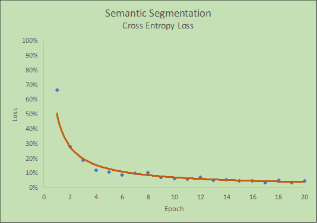

Project 2, Term 3: Semantic Segmentation
=======================

Final Result
------------

------------
Build the Neural Network
---------

#### Does the project load the pretrained vgg model?
The function load_vgg is implemented correctly.

#### Does the project learn the correct features from the images?
The function layers is implemented correctly.
#### Does the project optimize the neural network?
The function optimize is implemented correctly.
#### Does the project train the neual network?
The function train_nn is implemented correctly.  The loss of the network is printed while the network is training.

---------------
Neural Network Training
--------

#### Does the project train the model correctly?
On average, the model decreases loss over time:

#### Does the project use reasonable hyperparameters?
The number of epochs is set to 20 and the batch size is set to 10.

#### Does the project correctly label the road?

At least 80% of the road and no more than 20% of the non-road are correctly labeled

##### Five Random Samples Created by the project:

